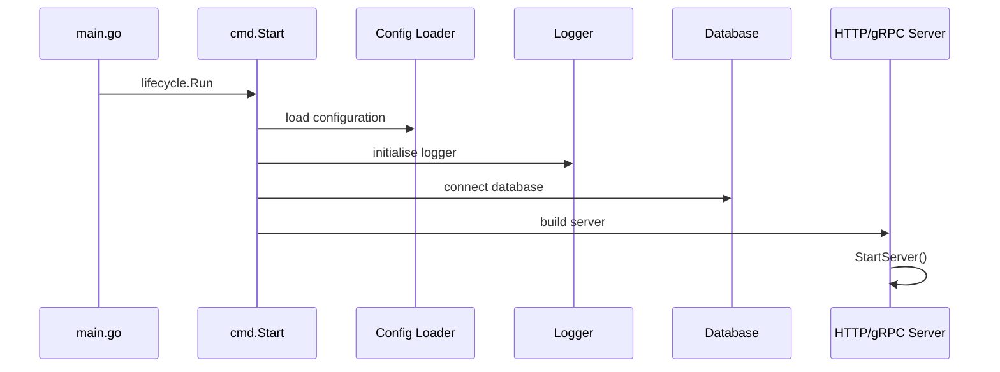
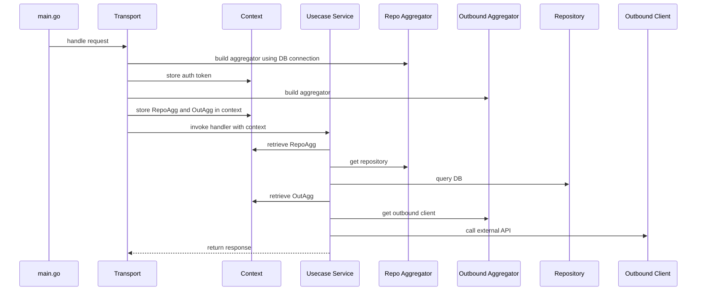
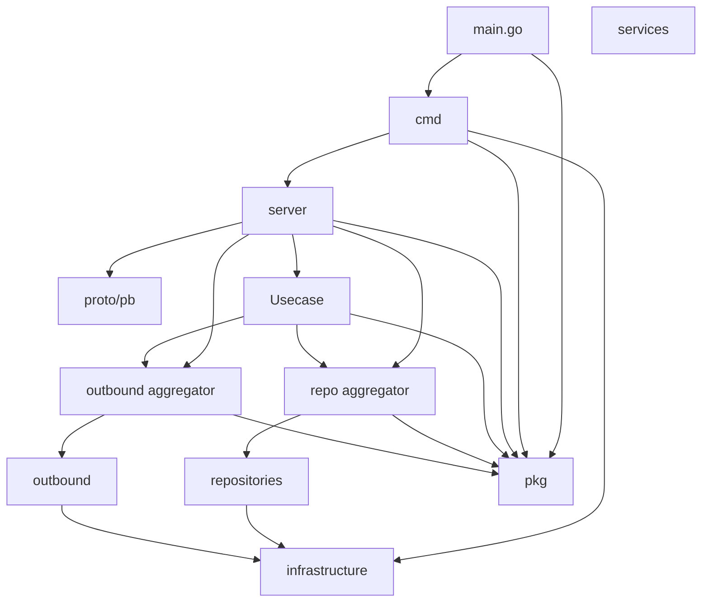
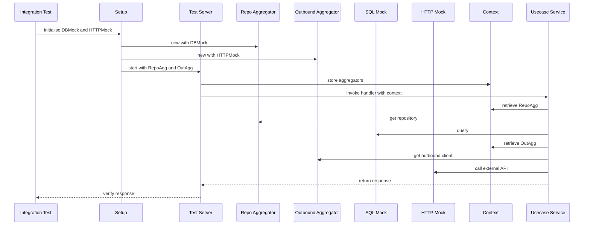

# Project Template BE

This repository provides a starting point for backend services written in Go. It demonstrates a typical structure for small services that expose REST and gRPC APIs, consume Kafka events and integrate with external systems.

This codebase uses a straightforward Controller, Service, Repository pattern. The business logic lives under `services` and stays free of infrastructure details. Controllers send responses through [neoma](https://github.com/MeGaNeKoS/neoma) which wraps successful bodies in a standard envelope and translates errors into a consistent format via the ErrorHandler. Error codes are defined in `pkg/code` and handlers return them directly, keeping the code concise across transports.
The controller layer is provided by the handlers under the `server` directory.

## Project Structure

The repository is organised into several top-level folders:

```text
.
├── cmd          # executable entry points
├── examples     # sample configuration and systemd units
├── infrastructure
├── outbound     # clients for external services
├── pb           # generated gRPC code
├── pkg          # reusable helpers
├── proto        # gRPC service definitions
├── repositories # data source access implementations
├── migrations   # database schema migrations
├── schema       # canonical table definitions
└── server       # REST, gRPC and Kafka transports
```

## Design Overview

- The project follows a layered approach:

- **`services`** – business logic organised by service (bounded context). Each first-level folder under this directory corresponds to a service such as `item` or `system`. See `services/README.md` for details.
- **`infrastructure`** – configuration loading, database helpers, utilities and the entry points found under `cmd`. See `infrastructure/README.md` for details.
- **`repositories`** – repository implementations for your data sources with an aggregator for lazy construction.
- **`server`** – transports for REST (`server/rest`), gRPC (`server/grpc`) and Kafka (`server/kafka`). REST routes are defined using `chi` and gRPC services are generated from `proto` definitions in the `proto` folder`. Transport selection is controlled with Go build tags: by default the REST server is included, but adding the `grpc`or`kafka`tags enables the other transports. Handlers under this directory act as the controllers. See`server/README.md` for more details.
- **`pkg`** – reusable helpers like the structured logger, lifecycle utilities and validation helpers. See `pkg/README.md` for details.
- **`proto`** and **`pb`** – Protocol Buffer definitions and generated code for the gRPC service.
- **`examples`** – sample configuration files and systemd units showing how to run the service under systemd. See [`examples/README.md`](examples/README.md).
- **`migrations`** – SQL files for evolving the database schema.
- **`schema`** – canonical table definitions used when generating migrations.
- **`infrastructure/dto`** – data transfer objects. Subfolders such as `dto/item` hold service-specific models, while common types live at the package root. See `infrastructure/dto/README.md`.
 - **`infrastructure/enums`** – enumerations shared across packages. See `infrastructure/enums/README.md`.
- **`infrastructure/supervisor`** – helpers for systemd based restarts. See `infrastructure/supervisor/README.md`.
- **`infrastructure/utils`** – miscellaneous helpers such as HTTP, JWT and path utilities. See `infrastructure/utils/README.md` for details.

Repositories are responsible for reading from and persisting to your data sources. Any communication with external systems—whether fetching data or triggering an action—lives under the `outbound` directory so services remain decoupled from specific clients.

The rule of thumb is that if you do not control the schema or lifecycle of the storage, it is **not** a repository. Treat other microservices, SaaS APIs and vendor products as outbound integrations even when they also return data. Only the databases and queues you provision directly are considered internal data stores.

Over several iterations we debated where to place external dependencies that both provide data and trigger actions. The guiding rule we adopted is simple: anything outside our direct control goes under `outbound`. A service may return information and also send emails or publish messages, but it is still considered outbound because the implementation relies on a remote system. Repositories are reserved exclusively for the databases or message stores we own and deploy ourselves.

### Repositories vs Outbound Clients

- **Repositories** – implementations that read from or write to our own storage. Typically these wrap SQL queries or another data store we manage.
- **Outbound clients** – code that communicates with third-party services or other microservices. Even if those calls return data, they belong under `outbound` because the behaviour depends on systems outside the repository's lifecycle.

### Internal Data Stores vs Outbound Services

_Internal data stores_ are the databases or messaging systems your own service controls. Examples include your MySQL/Postgres tables or internal queues that you manage and deploy. Code that reads from or writes to these stores lives in the `repositories` directory.

Anything beyond that boundary is treated as an _outbound service_. Whether it is another microservice maintained by your organisation, a SaaS provider, or a vendor API, the client code resides in `outbound`. This approach keeps the service layer ignorant of transport details while allowing you to stub external dependencies during tests.

The main entry point in `main.go` simply delegates to `cmd.Start` via the lifecycle runner which handles OS signals and clean shutdowns. Outbound service calls are grouped through the `outbound` package, allowing lazy construction of HTTP, gRPC or Kafka clients. During request handling the server builds repository and outbound aggregators. These are attached to the request context via `infrastructure/utils/context` so that services in the `services` layer can retrieve them without importing transport details.

### Architecture Summary

At a high level the project layers depend on one another as follows:

- `main.go` starts the application and delegates to the binaries under `cmd`.
- `cmd` packages initialise configuration from `infrastructure` and launch the appropriate server transport.
- `server` packages import repository and outbound aggregators to handle HTTP, gRPC or Kafka requests. They attach these aggregators to the request context so that the `services` layer can access them.
- `services` only depend on the aggregator interfaces and on helpers from `pkg`. They call concrete repositories (`repositories`) and outbound clients (`outbound`) obtained from the context.
- `repositories` and `outbound` packages depend on lower level helpers from `infrastructure` (such as the database driver or HTTP utilities) and on common helpers in `pkg`.
- `proto` holds the gRPC definitions which generate code under `pb`. The server imports the generated code when running the gRPC transport.

## Application Startup

The sequence below demonstrates how the application loads configuration and initialises shared services before the server begins listening.



## Request Flow

The sequence below illustrates how the server wires dependencies when processing a request. Both the repository and outbound aggregators are attached to the request context so the use case layer can retrieve them later.



The context helpers in `infrastructure/utils/context` provide the `Set` and
`Get` functions used above. This keeps the services layer free from transport
dependencies while still allowing it to access repositories and outbound
clients.

## Import Relationships

The diagram below illustrates the high level import flow between the main
packages. Dependencies generally point inward toward the core business logic
while shared utilities in `pkg` are used across layers.



## Getting Started

1. Copy `config.yaml` or `examples/config.yaml` and adjust the values for your environment. Set the `Version` field to your API version, or omit it to use `0.1rc`.
2. Run tests with:

```bash
go test ./...
```

3. Start the REST server:

```bash
go run .
```

To run using a different transport, build with the desired tag:

```bash
go run -tags grpc .   # start gRPC server
go run -tags kafka .  # start Kafka consumer
```

The command-line flags used by the entry points are documented in
`cmd/README.md`. They allow you to specify an alternative configuration file or
print the application version.

## Building the Project

Compile the binary with `go build`. Without build tags the REST server is included:

```bash
go build
```

Pass build tags to enable other transports or systemd support:

```bash
go build -tags grpc     # gRPC server
go build -tags kafka    # Kafka consumer
go build -tags systemd  # systemd supervisor helpers
```

Tags may be combined if required:

```bash
go build -tags "systemd"        # REST server with systemd support
go build -tags "grpc systemd"   # gRPC server with systemd support
go build -tags "kafka systemd"  # Kafka consumer with systemd support
```

The binary reads `config.yaml` from the working directory. Override the path with `--config`:

```bash
./project-template --config /etc/project-template/config.yaml
```

Embed build metadata using `-ldflags`:

```bash
go build -ldflags "-X project-template/cmd.branch=$(git rev-parse --abbrev-ref HEAD) -X project-template/cmd.gitCommit=$(git rev-parse HEAD) -X project-template/cmd.buildTime=$(date -u +%Y-%m-%dT%H:%M:%SZ)"
```

Use `--version` (or `-v`) to display this information at runtime.

## Systemd Support

Under `examples/systemd` you will find unit files demonstrating how to deploy
the application with systemd. The service can run by itself or under the
included supervisor unit if you want systemd to restart the process
automatically when it crashes. This supervisor approach ensures the service is
restarted cleanly so open files or network connections are properly released.

The `project-template.service` unit has several lines commented out. Enable
those along with `project-template.socket` and the supervisor unit when you
want to run the application under supervision. Socket activation lets both the
main and temporary instances bind to the same port while the old process shuts
down gracefully.

## Design Notes

Several choices in this template are intentionally opinionated. They are mostly illustrative and may not be ideal for real deployments:

- **Lifecycle runner** – `pkg/lifecycle` handles start and shutdown hooks in one place so commands remain minimal. Keeping this logic isolated also makes it easier to swap in a different supervisor or add custom behaviour when the process starts or stops.
- **Supervisor integration** – `infrastructure/supervisor` asks systemd to restart the service after a panic. Restarting ensures open file descriptors are fully released because the OS cannot clean them up while the process remains running. During a panic we cannot guarantee every resource is closed properly, so a full restart avoids lingering file handles or sockets.
- **Native `database/sql` with `goqu`** – using the standard library keeps the database layer lightweight. ORMs hide details and add a small performance cost. `goqu` is included purely as a safe query builder; it could drive execution too but that is left for later.
- **`chi` on top of `net/http`** – chosen almost entirely for its small footprint. The router sits directly on `net/http` so the binary stays tiny while still gaining HTTP/2 support. Most projects do not need the extra features and bloat that come with frameworks like Gin or Fiber.
- **Recover middleware triggers a restart** – after a panic the HTTP and Kafka layers call `RequestRestart`. Continuing in the same process risks leaking resources, so a clean restart is preferred.

These decisions highlight trade-offs and areas you may want to revisit when adapting the template for real projects.

## Testing Guidelines

Unit tests live alongside the code under each package but they rely heavily on mocks and stubs. That makes them brittle and expensive to maintain. Integration tests are far more valuable because they exercise the real implementations across layers with only the external boundaries mocked. These integration tests are placed under a dedicated `test` directory to keep them separate from the unit tests:

```text
test/
  item/
    rest/
      item_positive_test.go
      item_negative_test.go
    grpc/
      item_test.go
    kafka/
      consumer_test.go
      consumer_additional_test.go
  system/
    system_test.go
  files/
    files_test.go
```

The repository claims 100% coverage but that number is intentionally misleading. The unit tests were written only to prove how trivially coverage can be gamed with enough mocks. They provide little confidence in the behaviour of the service and ultimately make the project harder to maintain. In short, unit tests are essentially useless here. The integration tests above are far more valuable because they exercise the service end to end.

- **Database** – tests replace the SQL executor using `sqlmock` or a stubbed
  `ExecContext` so statements can be verified without a running MySQL server.
  Repositories themselves are not mocked; the queries they generate are still
  executed against the mocked executor.
- **Outbound calls** – the `sendHTTPRequest` helper (or the underlying
  `http.Client.Do` method) is patched to return canned responses. This lets the
  outbound aggregator logic run unchanged while avoiding real network calls.

Everything else – including the repository and outbound aggregators – remains as
in production so the wiring between layers is validated end to end.

## Test Flow

The following diagram illustrates how integration tests prepare a controlled environment before starting the server. A dummy SQL executor and a mocked HTTP client are created and passed into the repository and outbound aggregators. Those aggregators are then attached to the request context so the use case layer runs with the same wiring as in production.



## API Documentation

The REST server exposes autogenerated OpenAPI documentation. Start the server and
visit the public docs path (configurable, default `/public/docs`) for the public
endpoints. If the internal spec is enabled, visit the internal docs path to browse
all operations including hidden ones. Component schemas are available at
`/schemas/{name}.json`. Each JSON response includes a `Link` header pointing to
the relevant schema for client-side validation.

The docs paths, HTML renderer, and OpenAPI version are configured under the
`OpenAPI` section of `config.yaml`.

## Database Migrations

Database schema changes are tracked using [golang-migrate](https://github.com/golang-migrate/migrate). Migration files live under the `migrations` directory and are applied automatically during application start-up. The canonical table definitions are stored in the `schema` folder. Update those files first and then generate a migration by diffing the schema against your database. For example using [Atlas](https://atlasgo.io/):

```bash
atlas migrate diff --dir schema --dir migrations --name add_feature_table
```

You can still create empty migration files manually with `migrate create -ext sql -dir migrations -seq add_feature_table`. When the service boots it calls `RunMigrations` which ensures all pending migrations are applied before serving requests.
The migration location is configured via `Database.MigrationPath` in `config.yaml`, defaulting to `file://migrations`.
The DSN uses `multiStatements=true` so multiple SQL statements per migration run correctly. Dirty migrations are handled based on the `DirtyStrategy` enum set in `Database.DirtyStrategy` (`retry` or `skip`) which defaults to `retry`. When retrying a dirty migration, the failed version is rolled back one step (executing the `.down.sql` file) before applying migrations again, ensuring the database is left in a consistent state.
